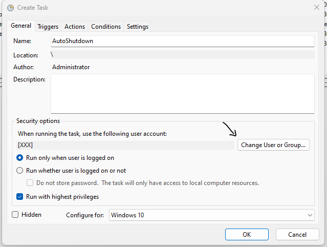
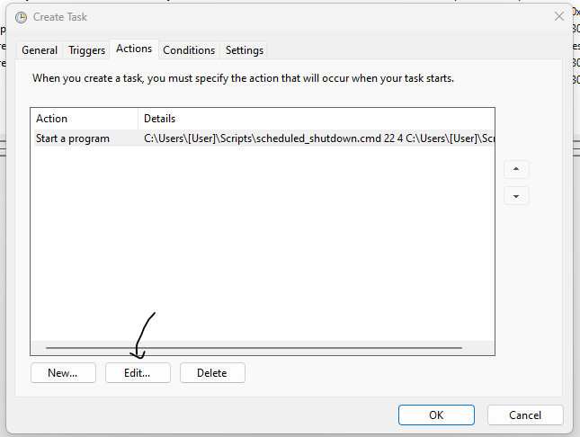

# Batch scheduled shutdown


Use this script if you want to prevent your computer from running at specified times.

It will turn off the pc at the specific time and every time it start during the programmed hours.

#### Usage


```batch
scheduled_shutdown.cmd [start hours] [end hours] [log path]
```

example

```batch
scheduled_shutdown.cmd 22 4 C:\Users\user\Desktop\log.txt
```


To schedule the script do the followings:

- Open windows task scheduler (⊞ Win + R, type `taskschd.msc` and press enter)
- Right click on the `Task Scheduler Library` and select `Import Task...`
- Import the file `AutoShutdown.xml`
- Adjust the running user 



- Adjust the script path and the arguments (or leave empty for defaults)


